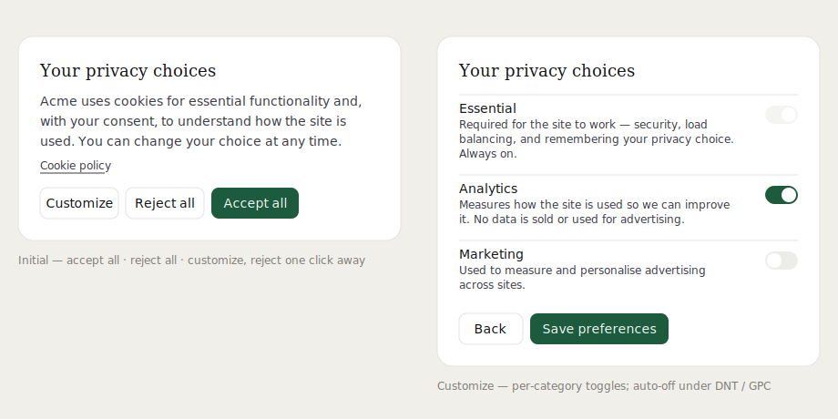

# consentium

A small, framework-light cookie-consent toolkit for **React** and **Next.js**.
Config-driven, i18n-agnostic, SSR-safe, and built with GDPR in mind — including
**Do Not Track** and **Global Privacy Control** support.

[](https://www.npmjs.com/package/consentium)
[](https://github.com/ivandrenc/consentium/actions/workflows/ci.yml)
[](./LICENSE)
[](./CONTRIBUTING.md)

<p align="center">
  
</p>

<p align="center">
  <a href="https://stackblitz.com/github/ivandrenc/consentium/tree/main/examples/vite-demo"><strong>▶ Try the live demo on StackBlitz</strong></a>
</p>

```tsx
import { ConsentProvider, CookieBanner } from "consentium";
import "consentium/styles.css";

<ConsentProvider config={consentConfig}>
  {children}
  <CookieBanner />
</ConsentProvider>;
```

---

## Why

Most consent libraries are either heavyweight SaaS scripts or barely-styled
checkboxes. consentium is the middle ground: one provider, one banner, one
stylesheet, and a tiny store you drive from your own code. You decide what each
category gates — the kit just records the decision and tells your app about it.

### Features

- **Category-based consent** — `essential` (always on) plus any optional
  categories you define (analytics, marketing, …).
- **Accept all / reject all / per-category** — the three flows GDPR expects,
  with reject one click away, side by side with accept.
- **SSR-safe** — renders the same on server and client, then resolves from
  `localStorage` after mount, so there is no hydration mismatch.
- **Do Not Track + Global Privacy Control** — categories you flag are forced off
  when the browser signals a privacy preference, even if toggled on.
- **Policy versioning** — bump `policyVersion` and returning visitors are
  re-prompted, keeping their prior choices as defaults.
- **i18n-agnostic** — English copy ships by default; pass a `copy` object to
  translate or reword everything. Wire it to next-intl, react-i18next, anything.
- **Themeable with CSS variables** — every token is a namespaced `--ck-*`
  custom property; no build-time CSS-modules needed.
- **No runtime dependencies** — just React as a peer. ~3 KB of JS, gzipped.
- **Reactive** — subscribe to consent changes to start/stop scripts live within
  a session.

> [!IMPORTANT]
> consentium is engineering tooling, **not legal advice**. It gives you the
> mechanism for lawful consent; you are responsible for the categories you
> declare, the copy you write, and whether your setup meets the rules in your
> jurisdiction. See [docs/gdpr.md](./docs/gdpr.md).

## Install

```bash
npm install consentium
```

Or straight from GitHub (builds itself on install via the `prepare` script):

```bash
npm install github:ivandrenc/consentium
# or pin a tag: npm install github:ivandrenc/consentium#v0.1.0
```

Requires **React 18 or 19**. The published npm package ships prebuilt, so it
installs on any supported Node. Building from source (the GitHub install or a
local clone) needs **Node 20+**.

## Quick start

### 1. Define a config

```ts
// consent.config.ts
import type { ConsentConfig } from "consentium";
import { presetCategories } from "consentium";

export const consentConfig: ConsentConfig = {
  productName: "Acme",
  storageKey: "acme_consent",
  policyVersion: 1,
  routes: { cookies: "/cookies", privacy: "/privacy" },
  categories: [
    presetCategories.analytics, // flagged respectDoNotTrack
    presetCategories.marketing,
  ],
};
```

### 2. Wrap your app and mount the banner

```tsx
import { ConsentProvider, CookieBanner } from "consentium";
import "consentium/styles.css";
import { consentConfig } from "./consent.config";

export default function Layout({ children }: { children: React.ReactNode }) {
  return (
    <ConsentProvider config={consentConfig}>
      {children}
      <CookieBanner />
    </ConsentProvider>
  );
}
```

The banner shows only while the visitor hasn't decided. After they choose, it
disappears and the choice is persisted.

### 3. Gate your scripts on consent

This is the part that actually matters for compliance — nothing tracking should
run before consent. Read the store and subscribe to changes:

```tsx
"use client";
import { useEffect } from "react";
import { useConsent } from "consentium";

export function Analytics() {
  const { store } = useConsent();
  useEffect(() => {
    const start = () => {
      if (store.hasConsent("analytics")) loadAnalytics(); // your loader
    };
    start();
    return store.subscribe(start); // react to later opt-in
  }, [store]);
  return null;
}
```

See [docs/recipes.md](./docs/recipes.md) for ready-made Google Analytics,
Google Tag Manager (Consent Mode), and PostHog gates.

### 4. Let visitors change their mind

Drop a settings link in your footer — withdrawing consent must be as easy as
giving it:

```tsx
import { CookieSettingsLink } from "consentium";

<footer>
  <CookieSettingsLink /> {/* re-opens the banner */}
</footer>;
```

## Documentation

| Guide                                    | What's in it                                                 |
| ---------------------------------------- | ------------------------------------------------------------ |
| [Configuration](./docs/configuration.md) | Every `ConsentConfig` field, categories, processors, cookies |
| [Theming](./docs/theming.md)             | The `--ck-*` token list and a dark-mode recipe               |
| [Next.js](./docs/nextjs.md)              | App Router setup, `<Link>` integration, the `/cookies` page  |
| [Internationalization](./docs/i18n.md)   | Translating copy; a next-intl example                        |
| [Recipes](./docs/recipes.md)             | Gating GA4, GTM Consent Mode, and PostHog                    |
| [GDPR notes](./docs/gdpr.md)             | What the kit does and does not do for you                    |
| [API reference](./docs/api.md)           | Every export, hook, and store method                         |

A runnable Next.js App Router example lives in
[`examples/nextjs-app-router`](./examples/nextjs-app-router).

## Theming

Override any `--ck-*` variable at a scope that wraps the banner:

```css
:root {
  --ck-color-accent: #4f46e5;
  --ck-color-accent-ink: #ffffff;
  --ck-radius-lg: 12px;
  --ck-font-display: "Your Serif", Georgia, serif;
}
```

Full token list and a dark-mode example: [docs/theming.md](./docs/theming.md).

## Without React

The store is framework-agnostic. Import from `consentium/core` to use it in
Vue, Svelte, or vanilla JS:

```ts
import { createStore } from "consentium/core";

const store = createStore({
  storageKey: "acme_consent",
  policyVersion: 1,
  categories: [{ id: "analytics", label: "Analytics", description: "…" }],
});

store.subscribe((rec) => console.log(rec));
if (store.hasConsent("analytics")) {
  /* … */
}
```

## Contributing

Contributions are welcome — see [CONTRIBUTING.md](./CONTRIBUTING.md). The gates
are `npm run typecheck`, `npm test`, and `npm run format:check`; all three run
in CI.

## License

[MIT](./LICENSE) © Ivan Naranjo
